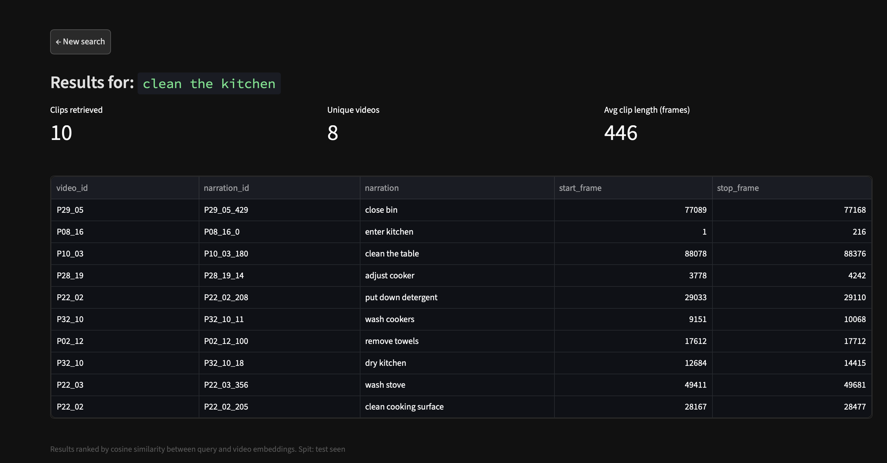

# Vision-Language Alignment with CLIP for Video

[](docs/REPORT.md)
[](LICENSE)

## 👥 Group and Project Information

| | |
|---|---|
| **Group** | Justgood AI |
| **Project ID** | 15 |
| **Members** | [Edoardo Tantari](https://github.com/eddy2809), [Raffaele Terracino](https://github.com/weiss25r)

## 📝 Project Description

Searching for videos traditionally relies on manually curated metadata rather than visual content. This project explores zero-shot cross-modal retrieval by aligning video features with natural language text using a contrastive loss model reminiscent of CLIP. The goal is to build a neural architecture that, given an arbitrary text query such as "person holding a flag on a mountain peak", retrieves the semantically matching clip from a large video collection — with no manual labels and no fine-tuning on the target domain. This is the text-video retrieval problem, and this project explores it using the EPIC-KITCHENS 100 dataset.

Project done as part of the course [**Deep Learning — Advanced Models and Methods**](https://antoninofurnari.github.io/deeplearning/) at University of Catania.

> 📖 **Official Report**: For theoretical details, performance analysis, architecture, and group contributions, see **[REPORT.md](docs/REPORT.md)**.

---

## 🛠 Tecnical Reproducibility

### 1. Clone the repository

```bash
git clone https://github.com/<your-username>/vision-language-alignment.git
cd vision-language-alignment
```

### 2. Create the conda environment

```bash
conda env create -f environment.yml
conda activate vla
```

### 3. Install PyTorch

PyTorch is **not** included in `environment.yml` to keep the environment hardware-agnostic. Install it manually based on your hardware. We used `torch 2.11.0`. 

---

##  Data Setup

To replicate the full pipeline, download the [Epic Kitchens dataset](https://academictorrents.com/details/c92b4a3cd3834e9af9666ac82379ff15ca289a83) and follow the "Data" section of the technical report.

If you only want to replicate baseline and best model training, download our pre-extracted features [here}(https://github.com/weiss25r/Vision-Language-Alignment-with-CLIP-for-Video/releases/tag/v1.0.0) 
— no need to process the raw dataset.

---

##  Training

Start training with:

```bash
python src/training/trainer.py --config experiments/configs/experiment.yaml
```

Resume from a checkpoint with `--ckpt <path_to_checkpoint>`.

Five config files are provided, one for each experiment described in the technical report:

| Config | Experiment |
|---|---|
| `MLP_timesformer_config.yaml` | Baseline |
| `full_fine_tuning_config.yaml` | Encoders fine-tuning |
| `CLIP_config.yaml` | CLIP features + adapter |
| `egovlp_plus_cliploss_config.yaml` | EgoVLP+ fine-tuned + adapter |
| `egovlp_egonceloss_config.yaml` | EgoVLP+ and EgoNCE loss + adapter (best model)|

Each experiment produces two checkpoints: `last` (final epoch) and `best` (lowest validation loss).

---

## Evaluation

Evaluate a trained model on the test set:

```bash
python src/evaluation/evaluate.py --config experiments/configs/experiment.yaml --ckpt <path_to_checkpoint> --test
```

Run inference on the validation set with `--validate` instead of `--test`.

---

## Demo
### Setup
To run the streamlit demo web-app, download pre-computed video embeddings and the model ready for inference from [here](https://github.com/weiss25r/Vision-Language-Alignment-with-CLIP-for-Video/releases/tag/v1.0.0) and place them into the app folder. Embeddings refers to split "test seen" of data. Run the app with:
```bash
streamlit run app/app.py
```

### Screenshot


*For the declaration of individual tasks and use of AI tools, refer to [`docs/REPORT.md`](docs/REPORT.md).*
